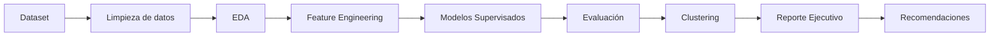

# 🏦 Bank Churn Prediction
### End-to-End Machine Learning Pipeline para la predicción del abandono de clientes bancarios

<!-- Aquí irá el banner -->

---

# 📊 Resumen del proyecto

| Indicador | Valor |
|-----------|------:|
| 📈 Churn del dataset | 20,4 % |
| 👥 Clientes analizados | 10.000 |
| 🤖 Modelos entrenados | 6 |
| 🏆 Mejor modelo | Stacking |
| 📊 ROC-AUC | 0.87 |

---

# 📑 Tabla de contenidos

- Caso de negocio
- Objetivos
- Dataset
- Tecnologías utilizadas
- Metodología
- Flujo del proyecto
- Desarrollo
- Resultados
- Competencias demostradas
- Valor agregado
- Próximas mejoras
- Autora

---

# 💼 Caso de negocio

La pérdida de clientes (*customer churn*) representa uno de los principales desafíos para las entidades financieras, ya que impacta directamente en el Customer Lifetime Value (CLV), los costos de adquisición y la rentabilidad del negocio.

El objetivo de este proyecto consiste en desarrollar un pipeline completo de Machine Learning capaz de identificar clientes con alto riesgo de abandono, permitiendo anticipar acciones de retención y optimizar la toma de decisiones comerciales.

---

# 🎯 Objetivos

- Predecir la probabilidad de abandono de clientes.
- Comparar diferentes algoritmos de Machine Learning.
- Identificar las variables con mayor influencia sobre el churn.
- Segmentar clientes mediante técnicas de aprendizaje no supervisado.
- Traducir los resultados en recomendaciones accionables para el negocio.

---

# 📂 Dataset

**Fuente:** Kaggle – Bank Customer Churn Dataset

Características principales:

- 👥 Registros: 10.000 clientes
- 📋 Variables: XX
- 🎯 Variable objetivo: **Exited**
- Tipo de problema: Clasificación binaria

Variables relevantes:

- Geography
- Gender
- Age
- Balance
- NumOfProducts
- IsActiveMember
- EstimatedSalary
- CreditScore
- Tenure

---

# 🛠 Tecnologías utilizadas

- Python
- Pandas
- NumPy
- Matplotlib
- Seaborn
- Scikit-learn
- XGBoost
- LightGBM
- CatBoost
- Git
- GitHub

---

# 🔄 Metodología

El proyecto fue desarrollado siguiendo la metodología **CRISP-DM**, recorriendo todas las etapas del ciclo de vida de un proyecto de Ciencia de Datos:

- Comprensión del negocio
- Comprensión de los datos
- Preparación de los datos
- Modelado
- Evaluación
- Recomendaciones

---

# 🔄 Flujo del proyecto

---

# 🚀 Desarrollo del proyecto

## 1️⃣ Exploración y preparación de datos

Se realizaron:

- Análisis Exploratorio de Datos (EDA)
- Limpieza y tratamiento de valores faltantes
- Ingeniería de variables
- Escalado
- Codificación de variables categóricas

### Principales hallazgos

- La edad incrementa significativamente el riesgo de abandono.
- Los clientes de Alemania presentan mayor probabilidad de churn.
- Un alto balance combinado con baja actividad aumenta el riesgo.
- Ser un cliente activo reduce considerablemente la probabilidad de abandono.

---

## 2️⃣ Modelado supervisado

Modelos implementados:

- Logistic Regression
- Random Forest
- XGBoost
- LightGBM
- CatBoost
- Stacking Classifier

Técnicas utilizadas:

- Validación cruzada estratificada
- GridSearchCV
- Optimización de hiperparámetros
- Early Stopping
- Regularización
- Feature Importance

---

## 3️⃣ Segmentación de clientes

Se aplicó K-Means para identificar perfiles de clientes con diferentes características de comportamiento y riesgo de abandono.

La segmentación permitió complementar el modelo predictivo con una visión estratégica para campañas de retención.

---

## 4️⃣ Consolidación y recomendaciones

Se compararon todos los modelos mediante:

- Accuracy
- Precision
- Recall
- F1-score
- ROC-AUC
- PR-AUC
- Matriz de confusión

Finalmente se elaboró un reporte ejecutivo con recomendaciones orientadas al negocio.

---

# 📈 Resultados

| Modelo | Accuracy | ROC-AUC | PR-AUC |
|---------|---------:|---------:|---------:|
| Logistic Regression | | | |
| Random Forest | | | |
| XGBoost | | | |
| LightGBM | | | |
| CatBoost | | | |
| **Stacking** | **XX** | **0.87** | **XX** |

---

# 📊 Visualizaciones

## Curva ROC

*(Agregar imagen)*

---

## Matriz de confusión

*(Agregar imagen)*

---

## Importancia de variables

*(Agregar imagen)*

---

# 💼 Competencias demostradas

- Machine Learning End-to-End
- Clasificación binaria
- Aprendizaje supervisado
- Aprendizaje no supervisado
- Optimización de hiperparámetros
- Validación cruzada
- Interpretabilidad de modelos
- Segmentación de clientes
- Storytelling con datos
- Traducción de métricas técnicas a decisiones de negocio

---

# ⭐ Valor agregado

✔ Pipeline completo de Ciencia de Datos.

✔ Comparación de seis algoritmos de Machine Learning.

✔ Integración de modelos supervisados y no supervisados.

✔ Interpretación de resultados orientada al negocio.

✔ Desarrollo siguiendo metodología CRISP-DM.

✔ Recomendaciones accionables para estrategias de retención.

---

# 🚀 Próximas mejoras

- Implementación de MLflow para seguimiento de experimentos.
- Despliegue mediante Streamlit.
- Automatización del pipeline.
- Monitoreo del modelo.
- Entrenamiento continuo.

---

# 👩‍💻 Autora

**Vanina Cavallin**

Dra. en Ciencias Biológicas

Data Scientist | Data Analyst

📧 Email: vaninacavallin@gmail.com

💼 LinkedIn: https://linkedin.com/in/vanina-cavallin
