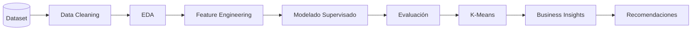

  

# 🏦 Bank Churn Prediction

> **Pipeline End-to-End de Machine Learning para predecir el abandono de clientes bancarios y generar estrategias de retención basadas en datos.**

 

📈 **Churn:** 20.4% &nbsp;&nbsp;&nbsp;|&nbsp;&nbsp;&nbsp;
🎯 **Mejor modelo:** Stacking &nbsp;&nbsp;&nbsp;|&nbsp;&nbsp;&nbsp;
📊 **ROC-AUC:** 0.87 &nbsp;&nbsp;&nbsp;|&nbsp;&nbsp;&nbsp;
👥 **Dataset:** 10.000 clientes &nbsp;&nbsp;&nbsp;|&nbsp;&nbsp;&nbsp;
🤖 **Modelos:** 6

---

## 🛠 Tecnologías

---

# 📌 Descripción

La pérdida de clientes (*Customer Churn*) representa uno de los principales desafíos para las entidades financieras, ya que impacta directamente sobre el **Customer Lifetime Value (CLV)**, los costos de adquisición y la rentabilidad del negocio.

En este proyecto se desarrolló un pipeline completo de Ciencia de Datos para identificar clientes con riesgo de abandono mediante técnicas de Machine Learning supervisado y no supervisado.

Más allá del desempeño predictivo, el objetivo fue transformar los resultados del modelo en **insights accionables** que permitan optimizar estrategias de retención de clientes.

---

# 📑 Tabla de contenidos

- Caso de negocio
- Objetivos
- Dataset
- Tecnologías utilizadas
- Metodología
- Flujo del proyecto
- Desarrollo
- Resultados
- Visualizaciones
- Competencias demostradas
- Valor agregado
- Próximas mejoras
- Autora

---

# 💼 Caso de negocio

La pérdida de clientes (*Customer Churn*) representa uno de los principales desafíos para las entidades financieras, ya que impacta directamente sobre el Customer Lifetime Value (CLV), los costos de adquisición y la rentabilidad del negocio.

El objetivo de este proyecto consistió en desarrollar un pipeline completo de Machine Learning capaz de identificar clientes con alto riesgo de abandono, permitiendo anticipar acciones de retención y optimizar la toma de decisiones comerciales.

---

# 🎯 Objetivos

- Predecir la probabilidad de abandono de clientes.
- Comparar distintos algoritmos de Machine Learning.
- Identificar las variables con mayor influencia sobre el churn.
- Segmentar clientes mediante técnicas de aprendizaje no supervisado.
- Traducir los resultados en recomendaciones accionables para el negocio.

---

# 📂 Dataset

**Fuente:** Kaggle – Bank Customer Churn Dataset

**Características principales**

- 👥 10.000 clientes
- 📊 10 variables predictoras
- 🎯 Variable objetivo: **Exited**
- 🤖 Problema de clasificación binaria

Variables principales:

- CreditScore
- Geography
- Gender
- Age
- Tenure
- Balance
- NumOfProducts
- HasCrCard
- IsActiveMember
- EstimatedSalary

---

# 🛠 Tecnologías utilizadas

- Python
- Pandas
- NumPy
- Matplotlib
- Seaborn
- Scikit-learn
- XGBoost
- LightGBM
- CatBoost
- Git
- GitHub

---

# 🔄 Metodología

El proyecto fue desarrollado siguiendo la metodología **CRISP-DM**, recorriendo todas las etapas del ciclo de vida de un proyecto de Ciencia de Datos:

- Comprensión del negocio
- Comprensión de los datos
- Preparación de los datos
- Modelado
- Evaluación
- Comunicación de resultados

---

# 🔄 Pipeline del proyecto

---

# 🚀 Desarrollo del proyecto

## 1️⃣ Exploración y preparación de datos

Se realizaron:

- Análisis Exploratorio de Datos (EDA)
- Limpieza y preprocesamiento
- Ingeniería de variables
- Escalado
- Codificación de variables categóricas

### Hallazgos principales

- La edad incrementa significativamente el riesgo de abandono.
- Los clientes de Alemania presentan mayor probabilidad de churn.
- Un alto balance combinado con baja actividad incrementa el riesgo.
- Los clientes activos presentan menor probabilidad de abandono.

---

## 2️⃣ Modelado supervisado

Modelos implementados:

- Logistic Regression
- Random Forest
- XGBoost
- LightGBM
- CatBoost
- Stacking Classifier

Técnicas aplicadas:

- Validación cruzada estratificada
- GridSearchCV
- Optimización de hiperparámetros
- Early Stopping
- Feature Importance

---

## 3️⃣ Segmentación de clientes

Se aplicó **K-Means** para identificar perfiles de clientes con diferentes características de comportamiento y riesgo de abandono.

La segmentación permitió complementar el modelo predictivo y proponer estrategias diferenciadas de retención.

---

## 4️⃣ Consolidación y recomendaciones

Se comparó el desempeño de todos los modelos mediante:

- Accuracy
- Precision
- Recall
- F1-score
- ROC-AUC
- PR-AUC
- Matriz de confusión

Finalmente se elaboró un reporte ejecutivo con recomendaciones orientadas al negocio.

---

# 📈 Resultados

| Modelo | Accuracy | ROC-AUC | PR-AUC |
|---------|---------:|---------:|---------:|
| Logistic Regression | 0.714 | 0.777 | — |
| Gradient Boosting | **0.869** | **0.870** | — |
| **Stacking Classifier** | **0.871** | **0.871** | **0.725** |

---

# 📊 Visualizaciones

## 📈 Curva ROC

La curva ROC permite evaluar la capacidad discriminatoria del modelo para distinguir entre clientes que abandonan el banco y aquellos que permanecen. El mejor modelo alcanzó un **ROC-AUC de 0.87**, indicando un alto poder predictivo para el problema de churn.

---

## 🎯 Importancia de variables

El análisis de importancia de variables mostró que **Age**, **NumOfProducts**, **IsActiveMember** y **Balance** fueron los principales factores asociados al abandono de clientes. Esta información resulta clave para diseñar estrategias de retención focalizadas y comprender el comportamiento del modelo.

---

## 🔍 Matriz de confusión

La matriz de confusión resume el desempeño del modelo sobre el conjunto de prueba. Permite visualizar la cantidad de clientes correctamente clasificados y los errores de predicción, facilitando el análisis del equilibrio entre falsos positivos y falsos negativos según los objetivos del negocio.

---

# 💼 Competencias demostradas

- Machine Learning End-to-End
- Clasificación binaria
- Aprendizaje supervisado
- Aprendizaje no supervisado
- Optimización de hiperparámetros
- Validación cruzada
- Interpretabilidad de modelos
- Segmentación de clientes
- Storytelling con datos
- Traducción de métricas técnicas en decisiones de negocio

---

# ⭐ Valor agregado

✅ Desarrollo de un pipeline completo de Ciencia de Datos.

✅ Comparación de múltiples algoritmos de Machine Learning.

✅ Integración de modelos supervisados y no supervisados.

✅ Interpretación de resultados orientada al negocio.

✅ Aplicación de la metodología **CRISP-DM**.

✅ Generación de recomendaciones accionables para estrategias de retención.

---

# 🚀 Próximas mejoras

- Implementar seguimiento de experimentos mediante MLflow.
- Desplegar el modelo con Streamlit.
- Automatizar el pipeline de entrenamiento.
- Incorporar monitoreo del modelo.
- Implementar técnicas de Explainable AI (SHAP y LIME).

---

# 👩‍💻 Autora

**Vanina Cavallin**

Dra. en Ciencias Biológicas

**Data Scientist | Data Analyst**

📧 **Email:** vaninacavallin@gmail.com

💼 **LinkedIn:** https://linkedin.com/in/vanina-cavallin
